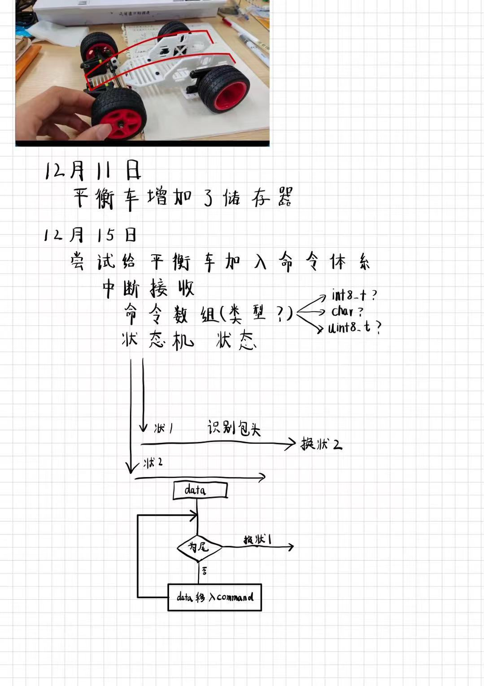

# Owl_balcar

无人机的前置项目
旨在对于PID参数以及其余部分进行学习

平衡车是亚博的套件，生态有些封闭
MPU6050读取是采用其官方库


2024年12月15日

草拟了状态机构思



**仍是状态机的思路，数据包头为字符“s”，包尾为“e”，数据长度不限**


```c
void DEBUG_USART_IRQHandler(void)
{
	static uint8_t RxState = 0;		//定义表示当前状态机状态的静态变量
	static uint8_t pRxPacket = 0;	//定义表示当前接收数据位置的静态变量
	if (USART_GetITStatus(DEBUG_USART, USART_IT_RXNE) == SET)		//判断是否是USART2的接收事件触发的中断
	{			
		char RxData = USART_ReceiveData(DEBUG_USART);  //读取数据寄存器，存放在接收的数据变量
		/*使用状态机的思路，依次处理数据包的不同部分*/
		
		/*当前状态为0，接收数据包包头*/
		if (RxState == 0)
		{
			if (RxData == 's')			//如果数据确实是包头
			{
				memset(Command, 0, sizeof(Command));  // 清空Command数组
				RxState = 1;			//置下一个状态
				pRxPacket = 0;			//数据包的位置归零
			}
		}
		/*当前状态为1，接收数据包数据*/
		else if (RxState == 1)
		{
			
			if (RxData == 'e')			//如果数据确实是包尾部
			{
				RxState = 0;			//状态归0
				ComFlag = 1;		//接收数据包标志位置1，成功接收一个数据包
			}
			else
			{
				Command[pRxPacket] = RxData;	//将数据存入数据包数组的指定位置
				pRxPacket ++;				//数据包的位置自增
			}

		}
		
		USART_ClearITPendingBit(DEBUG_USART, USART_IT_RXNE);		//清除标志位
	}
}
```

2024年12月16日 09点34分

草拟了命令行思路


```c
void GetCommand(char* command,struct Commandlists *list)
{	
	const char delims[] = " "; // 空格作为分隔符
	char *token;
	static uint8_t ComState = 0;		//定义表示当前状态机状态的静态变量
	memset(list->head, 0, sizeof(list->head));  // 清空字符串
	memset(list->mid, 0, sizeof(list->mid));  // 清空字符串
	memset(list->detail, 0, sizeof(list->detail));  // 清空字符串
	// 获取第一个子串
    token = strtok(command, delims);
    while (token != NULL) {
//        printf("Token: %s\n", token);
		if (ComState == 0)
		{
			strcpy(list->head,token);
			ComState = 1;	
		}
		else if (ComState == 1)
		{
			strcpy(list->mid,token);
			ComState = 2;
		}
		else if (ComState == 2)
		{
			strcpy(list->detail,token);
			ComState = 0;
		}
        // 继续获取后续子串
        token = strtok(NULL, delims);
    }
//	printf("Head: %s,Mid: %s,Detail: %s\n",list->head,list->mid,list->detail);
}
```

